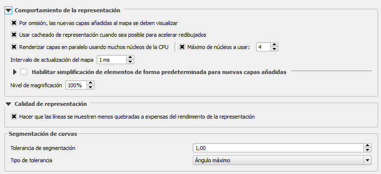
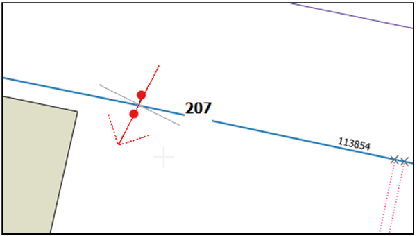
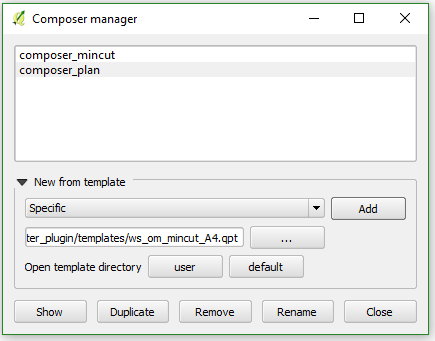

# 11. Other considerations

## 11.1 Good practice
* Rendering

1) Only what is seen is rendered:

It is necessary to study the performance and take a decision (activate).

It is especially important to gain the speed of the project.

5000 only arcs >

<5000 tanks

<2000 everything

<1500 connecs

<1000 links

<500 virtuals

2) Properly configure QGIS

Open: *Settings > Options > Rendering*. The configuration that is displayed in the following image would be a correct example for layer rendering.

|  |
|:------------------------------------------------------------------:|
| *Example of configuration necessary for the proper functioning of the rendering.*|

Each layer should also be controlled: Layer properties > Style > Layer rendering

|  |
|:------------------------------------------------------------------:|
| *Correct layer rendering.*|

## 11.2 Feature’s rotation
Usually, the elements of the water supply and sanitation networks are going to be represented in asymmetric ways, making the rotation of the element particularly important to visualize it in the desired way. This often leads the user to wonder how can I give a specific rotation to the element?

The Giswater plugin does not incorporate a specific tool for the rotation of elements, but there is a QGIS tool that will allow to establish it very easily. This tool requires that the layer that we want to rotate has assigned a field as variable of rotation. In Giswater projects, all elements of the network have available a field called 'rotation' that pursues this goal. To use the rotation of QGIS, it must be configured as a rotation management variable, as shown in image below.

|  |
|:------------------------------------------------------------------:|
| *To use the rotation, in the layer properties, the field ‘rotation’ should be configured as the attribute variale that controls the rotation of the symbol.*|

To use the rotation, in the layer properties, the field ‘rotation’ should be configured as the attribute variale that controls the rotation of the symbol.
With the correct configuration, we are ready to use the QGIS tool that will allow to rotate the node type elements.

The tool will only be activated if the layer is in edition mode. After clicking on the button, we must select the option *Rotate Point Symbols* and click on a specific item. Holding down the left mouse button, the element can be rotated, helped by a perpendicular line. When we see that the element is in the desired rotation, we must save it and close the edition to finish the modification. We will see the result visually, but internally what the tool has done is modify the value of the rotation field for the specific element in our database.

|  |
|:------------------------------------------------------------------:|
| *The process of elements rotation involves accompanying the selected element with the mouse, helped by a perpendicular line.*|

## 11.3 Management and use of the QGIS composer
Giswater offers to its users different templates to generate plans and maps of some part of the project. As already mentioned in previous sections, some tools directly incorporate the generation of plans using the *composer* templates. As example, the tools of the longitudinal profile, the cutting polygon or the planning sectors generate plans directly.

The Giswater *plugin* folder has a subfolder named templates that contains several *qpt* files, QGIS templates, that the user can call from the composer manager and add them to the project. Initially, in this folder there are templates to make plans of the longitudinal profile, cutting polygon and the planning sectors for both A3 and A4 format.

However, each user can generate their own templates for the *composer*, so that any generated plan can have the desired appearance. For less experienced users, a good way to generate your own template is to copy some of the existing ones in Giswater and modify some of its parts.

|  |
|:------------------------------------------------------------------:|
| *Composers management form. Those linked to the QGIS project are represented here. In the templates folder there are more templates unlinked with the project.*|