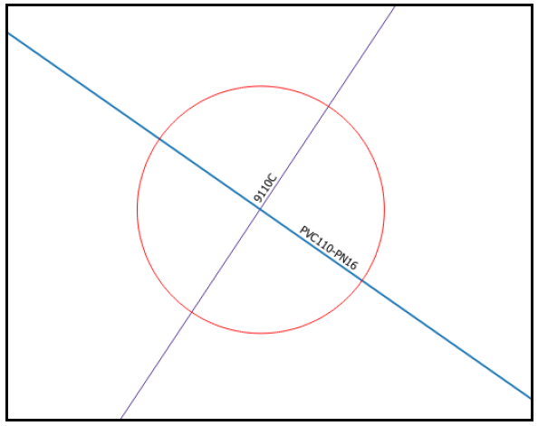
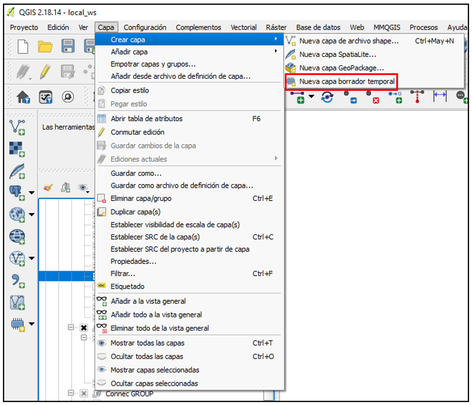
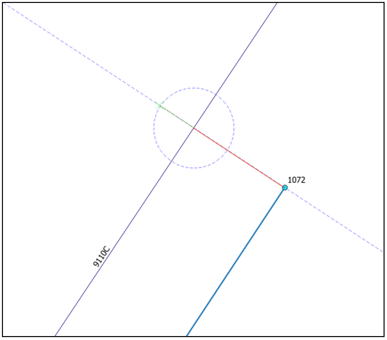
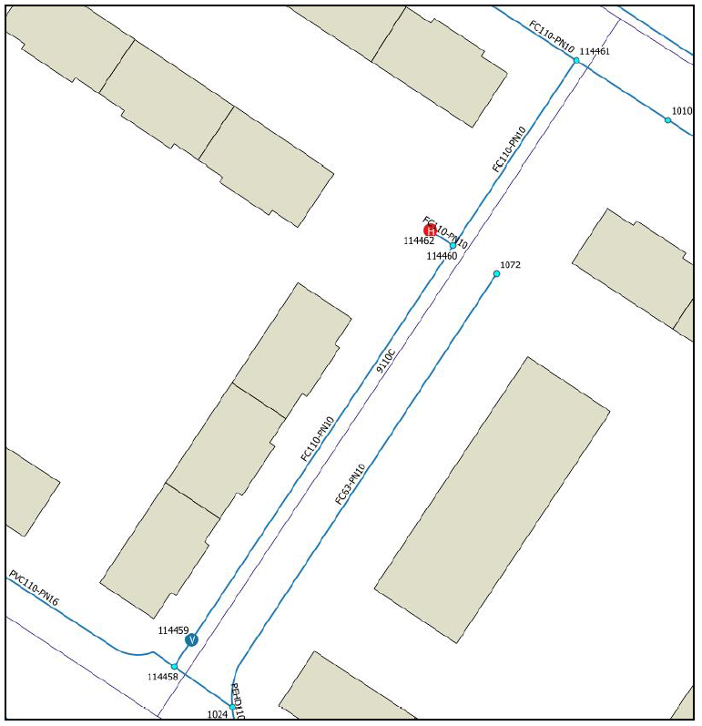

# 6. How to digitalize the network

Once all the tools of the Giswater *plugin* are known, it is time to use the full potential of the program and start working with the water network. It is considered appropriate and interesting to dedicate a section to know the necessary steps to digitize parts of the network, because it is one of the most common processes for those in charge of managing it.

Here below you can find those steps, and some data and hierarchy relations when filling the layers with your project. Furthermore, **additional technical information** is compiled at the GitWiki:

[Inventory tables · Giswater Wiki](https://github.com/Giswater/giswater_dbmodel/wiki){ .md-button .md-button--primary }

[Steps to create your first project · Giswater Wiki](https://github.com/Giswater/giswater_dbmodel/wiki){ .md-button .md-button--secondary }

## 6.1 Previous step

If we are faced with an empty project, before inserting any element, we must consider some initial steps. Next, we will see in a practical way what it is necessary to do:

**1 - Fill in the catalogs**

It is necessary to fill in the catalogs of elements that will be introduced. Initially the data must be entered in the *cat_feature, cat_feature_node, cat_feature_arc, cat_feature_connec, cat_feature_gully(ud) tables*. We remind that the catalogs are explained in section **4.2.1.1** of this manual.

The following scheme shows the hierarchy of existing catalogs within Giswater:

Before the element catalogs, it will be necessary to have some record in the material catalog, both for arcs and for nodes.

**2 - Map zones**

As it was presented in the section **3.4** the map zones are are essential for the use of Giswater, so that, before introducing elements, a series of zones of the map must be defined.

It can be done directly with the QGIS project, looking for the corresponding layer and adding a geometric element (polygonal). The relation of creation of zones of the map, in order, should be this:

1. Macroexploitation (without geometry)
2. Exploitation
3. Dma
4. Sector
5. Municipality

## 6.2 Digitalization of the network

Part of the plugin tools are used to digitize, especially those associated with role_edit, but other parameters must be considered so that the insertion of new elements is correct and precise. Next, it will be explained in detail which are the steps to follow, in chronological order, to digitize new elements, both linear and specific:

* **Example of digitalization of a new section of the network**

Through a practical example, carried out in one of the sample projects of Giswater, it will be explained how a new section of the network can be generated, which will consist of the insertion of 5 new nodes and 4 arcs. All these new elements must be placed in a specific position, as represented in the image below, simulating a real work.

|  |
|:------------------------------------------------------------------:|
| *The elements to be incorporated in this example must be located on the points marked in the image. The exact distances between elements are specified.*|

The elements represented in the image refer to the nodes, which will consist of 3 junctions (Junction), located at the intersections of the arcs, a valve, and a hydrant. The arcs will be all pipes (Pipe), which will be drawn in a straight line connecting the nodes.

**Process***

1 - Before creating any element, it is especially important to know which are the **mandatory** fields for each type of element are, so that, if they are not filled in during the insertion, it will not be completed. The following table specifies these fields and how they can be filled in, since Giswater offers different methods to facilitate the insertion of data. In the form itself the mandatory fields are marked with a *

| **Field**             | **In case leaving it *NULL*, how is it filled in?**                        |
|-----------------------|----------------------------------------------------------------------|
| **Node/Arc catalog**  | Default value (one for each element)                                 |
| **Municipality**      | Default value, if not the value is captured from geometry           |
| **Exploitation**      | Default value, if not the value is captured from geometry           |
| **Dma**               | Value is captured from geometry, if not it uses default value       |
| **Sector**            | Value is captured from geometry, if not it uses default value       |
| **State**             | Default value, if not the first value from `value_state` table      |

2 - As we see, it is important to configure default values, since many times the insertions of new elements will be made in the same municipality, exploitation, dma and sector. The default values will allow to work faster. For this example, using the configuration tool, we set the default values for *Hydrant catalog, Junction catalog, Valve catalog, Verified* (field not mandatory but recommended), *Exploitation, Municipality, Sector* and *Dma*. The state will be entered manually each time.

|  |
|:------------------------------------------------------------------:|
| *In the form of Configuration, we mark the default values we want to use for this specific example. These can be modified as many times as the user wants.*|

3 - If we want to digitize with an extremely high degree of precision in the placement of elements, as is the case in this example, before entering any element we must draw support points to then place the nodes in the specific place. To draw these support points there are different options: the CAD tools of the Giswater plugin or other tools incorporated into QGIS, such as the ‘advanced digitization tools’.

4 - To draw the first support point, which must be 2 meters from the intersection between the street 9110C and arc PVC110-PN16, we will use the 'Create Circle' plugin tool. With the snapping activated, place the cursor over the intersection and click. The radius of the circle must be 2 meters.

|  |
|:------------------------------------------------------------------:|
| *The circle of 2 meters radius will be used to place the node in the exact point.*|

5 - At the intersection of the circle line with the Pipe layer is where we must place the first Junction element. Using the keyboard shortcut (J) we place the new element just above the intersection. To know that we have done it well, the program must show a window that indicates that we are going to break an arc. As we have many values established by default, in the element form we only must indicate the status, in this case, ON SERVICE. We will also mark the type of status as ON SERVICE.

6 - With the first element already introduced, now we need to place the second support point, which will serve to mark the location of where we want to insert the valve. This should be 12 meters from the beginning of the street 9110C and 2 meters to the left.

7 - With the tool 'Add relative point', we mark the first point at the beginning of 9110C street of the Streetaxis layer and another at a certain distance on the same line. This way we can draw a point 12 meters from the beginning (x) and 2 meters towards the outside (y).

|  |
|:------------------------------------------------------------------:|
| *The second node will be located over the red point, generated using the ‘Add relative point’ tool.*|

8 - Just above this support point is where we place the new valve. As before, the only values we fill in manually are the state and the state type. The rest are configured by default.

9 - To draw the next support point (in this case it will be a line), we will use the QGIS tools. With the **advanced digitizing panel**, it is possible to draw a line perpendicular to node 1072 and which, at the same time, is 2 meters from the street 9110C.

10 - The first step is to generate a new temporary draft layer (Image below). It must be a linear layer, with the same EPSG as our project has. Once created, we put the layer in edition and click on 'Add spatial object'.

|  |
|:------------------------------------------------------------------:|
| *From Layer we can add a new temporary layer*|

11 - With the advanced digitizing panel active, we first select the node from which we want the new line to start. Then we click on the 'Perpendicular' button and select the arc that will serve as a reference to draw the perpendicular line, in this case the Pipe showed in the next image. We should note that a fine auxiliary line is drawn perpendicular to the desired node. Now, we can click on the street axis, thus establishing the first part of the line. Without stopping the edition, we establish a radius of 2 meters in the field where it says 'd', considering that we must be located above the axis of the street. We click again on the auxiliary line, now just above the intersection with the generated 2-meter circle. Once we see that the red line reaches where we want, we click the button to the right of the mouse to end the support line.

|  |
|:------------------------------------------------------------------:|
| *With the panel of advanced digitizing, it is possible to draw a perpendicular line to another element at the desired distance. The red line represents a section that will be saved in the temporal table. The left side of the circle also has the line slightly painted red.*|

12 - Using this line, we can place the third node of the example, in this case a union of type 'T'. In the same way as in previous cases, we insert the new element right at the limit of the support line, knowing that it is exactly where it should be: two meters from the street axis, perpendicular to the other pipeline and at the same height as the union that ends this pipe.

13 - At this moment we want to place the hydrant, which must be 4 meters from the junction that we have just generated and at the same height. As we have the support line still visible on the map, we will use it again to locate the new support point. Knowing that it must be at the same height as the line, with the 'Add relative point' tool, we will introduce a support point.

14 - With this tool we mark a point on the node 114470 and another one on the support line of the temporal layer. The 'x' must be -4 and 'y' must be 0. As we have clicked on the node first, we select the *Init point* as the exit point of the relative element.

|  |
|:------------------------------------------------------------------:|
| *The Add Relative Point tool will be used to place a point at a certain distance from another element. The timeline is selected with a box for better viewing.*|

15 - Next, we place the hydrant element just above the support point that we just added. As always, with the default values configured, we just manually add the node state.

16 - Now we have added four out of five nodes that were planned at the beginning of the example. To insert the last union, which will break the arc FC110-PN10, we will use the same method as in the first union of the example: draw a circle with a radius of 2 meters at the intersection of the arc and the street axis.

17 - We insert a union element, checking that the arc was divided into two.

18 - We have finished inserting nodes. Currently, we only have to connect the different nodes with arcs. The insertion process is quite simple.

19 - At the beginning of the example, we only established the default values for node-type elements. Now we must add the default value for the arc catalog, in this case FC110-PN10, so the insertion will be faster.

20 - To add the first pipe, using the keyboard shortcut 'P', we choose the start node and the final node, and clicking with the left mouse button to set it and with the right button to finish the line.

21 - We repeat the process of inserting pipeline elements to join all the nodes created during this example, so that the network connects from one side to the other. The final result can be seen in image below.

|  |
|:------------------------------------------------------------------:|
| *The new network section, planned in the first image of this section (6.2), can be seen in this image, so that the nodes and the inserted arcs connect the existing network sections. The new elements are placed exactly where planned, so that the representation of the real network is as accurate as possible.*|

## 6.3. QGIS Advanced Digitizing Panel
Apart from Giswater plugin's functions, another great tool to accurately digitize the network is the Advanced Digitizing Panel, a group of tools ready to use by default in QGIS.

This panel allow users to draw support points or lines to later insert the network using these supports. It's especially useful when some parallel or perpendicular lines are needed.

In the next image there's a complete schema of the functionality of the panel, since it's not easy to use at the beginning.

|  |
|:------------------------------------------------------------------:|
| *Complete schema of the QGIS Advanced Digitizing Panel. Source: https://pigrecoinfinito.com*|

Complete schema of the QGIS Advanced Digitizing Panel. Source: https://pigrecoinfinito.com
Previous

*Figure 1: test.*