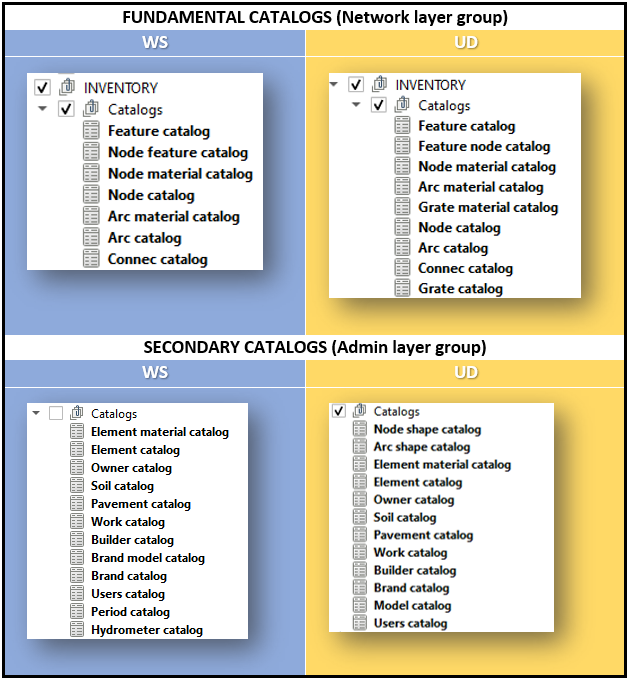
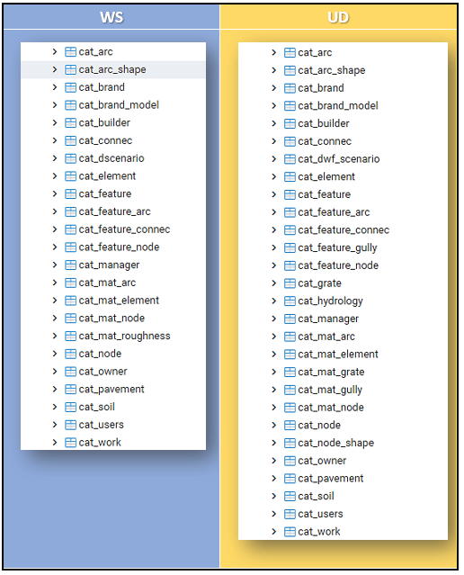
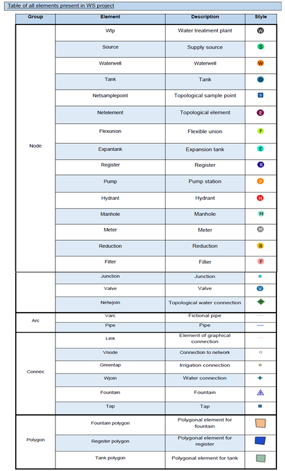
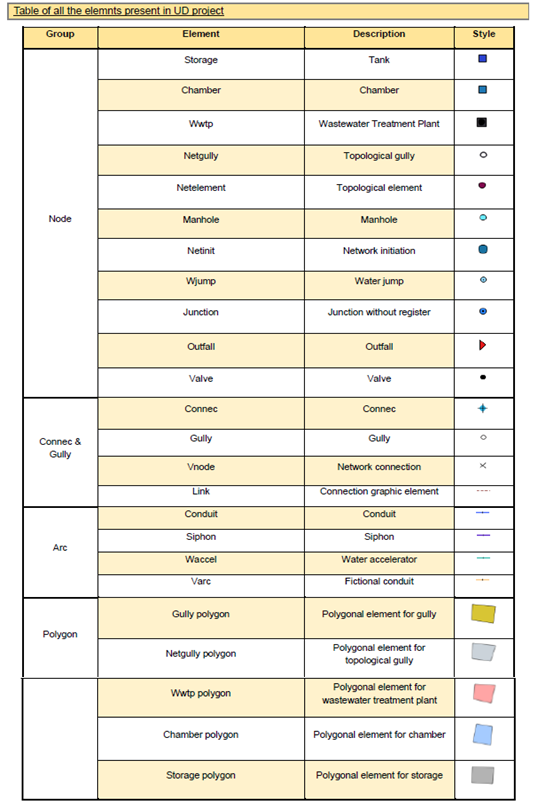
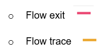
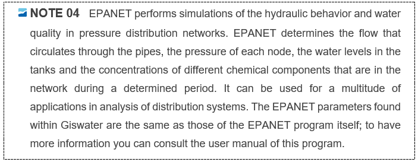
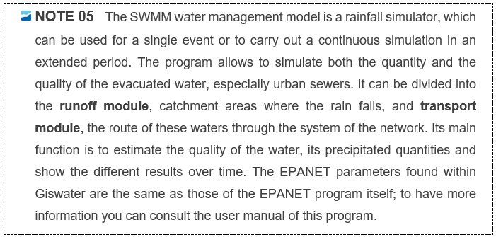

# **4. Working environment in QGIS**

While all GIS systems are compatible with the Giswater tool, the same does not apply to the plugin since it has been programmed as a complement to QGIS. Thus, all the available functionalities will be executed from the QGIS environment.

## **4.1 Graphic interface**

Any user that requires the use of Giswater plugin must be familiar with geographical information systems (GIS).

Once the user has created a new data project, with the Giswater tool, as explained in section 2.5, he is already able to open the QGIS project and start working with it. In this manual the example project for water supply (ws_sample) will be used.

The main parts of the QGIS environment in relation to Giswater and its plugin are shown below.

|  |
|:------------------------------------------------------------------:|
| *Graphic interface in Qgis*|

## **4.2 Table of Contents**

The ToC (Table of Contents) is where all the necessary tables and views of the database are loaded to work with Giswater. To have the information well structured, this topic has been divided into seven large groups that will also facilitate the management of roles (depending on the permissions of the user, he should be able to manage certain tables, which by default belong to a group). These groups are: **Inventory of assets, Operations and Maintenance (O&M), EPA Analysis, Masterplan, System tables and Base maps.**

In this section all the tables and views that are loaded in QGIS are described, to facilitate the user understanding of the complex network of tables that Giswater is composed of. Each table has a variable number of fields with information related to what the table represents. As the amount of information in this section would be exceptionally large, most of the definitions of tables and fields are presented in the annex of the manual. However, the user will find below enough information to understand the purpose of each group of tables.

### 4.2.1 Inventory of assets (INVENTORY)

This group contains some information about the network assets inventory, and it is divided into four subgroups: Catalogs, Map zones, Network elements, and Others.

#### 4.2.1.1 Catalogs

First of all, it is important to mention that the catalogs layers on the ToC are mainly distributed into two different subgroups. The first subgroup belongs to the Inventory Layers. This is where we can find our fundamental catalogs, which means preliminary information necessary to build our network system. The second subgroup belongs to the Admin layers, for which you can find more detailed information at the end of this manual chapter. There are other few catalogs on the EPA subgroup, which its content follows the EPA/SWMM hydraulic model logic.

An image with the two main subgroups that contains the catalogs layers, just as can be found on Qgis ToC, and the layers name on the DB manager can be checked on the images below.

|  |
|:------------------------------------------------------------------:|
| *Fundamental and secondary catalogs layers distributed in different subgroups on ToC*|

|  |
|:------------------------------------------------------------------:|
| *Catalogs layers, with respective nomenclature when visualized on the DB manager.*|

**Fundamental Network Catalogs**  (the name of the table in the database in parentheses)

Feature catalog (cat_fearture)

Feature node catalog or Node feature catalog (cat_feature_node)

Node catalog (cat_node)

Arc catalog (cat_arc)

Node material catalog (cat_mat_node)

Arc material catalog (cat_mat_arc)

Connec catalog (cat_connec)

Grate catalog* (cat_grate)

Grate material catalog* (cat_mat_grate)

> ℹ️ **Yellow colours just apply to UD schemes!**

**Pre-dependencies:**

Catalogs generate many dependencies, in fact, they must be filled before starting to work since their records will be requested in many system tables. Also, it should be noted that the catalogs also have dependencies between them. In this sense, before filling the arc and node catalogs, the preceding catalogs, which are the node materials and the arc materials, must be filled out. Before starting to work on the catalogs, the system tables that typify the different elements of our network must be filled in (see section **2.5.1.1**):cat_feature_node (for the node catalog case)cat_feature_arc (for the arc catalog case)cat_feature_connec (for the connection catalog case)cat_feature_gully (for the case of gully catalogs in UD)Although they are not loaded in QGIS, it is important to explain at this point how the higher hierarchy catalogs, already mentioned in section **4.2.1.1**, work. It is explained as an example for node, but the explanation can be extrapolated to arc, connec and gully.

* **Cat feature node** (*cat_feature_node*): The table characterizes the different types of node that our project can have. The type of nodes that the system allows - *type* field, from now on *'system node type'* - is not modifiable or expandable. What you can do is have as many node type elements as you want - *id* field, from now on *'custom node type'* - with the same system *node type* attribute, as long as this attribute is in the system.

It is important to know that:

* Each *'system node type'* has a defined data model, different from the others. If you want to create new records of node types, you must first analyze which of the different data models of the system nodes best suits the new 'node custom type' that we want to create.
* For each *'custom node type'* we can define a default value of the element type in the hydraulic model. This default value is MANDATORY, but for each network element it can be modified at any time by the hydraulic engineers.
* The *'custom node type'* allows us to customize the names of the elements in the language we want. This allows that, although the system always works with the *'system node type'* this will always be transparent for the user who will never see the *'system node type'* but will always work with the *'custom node type'*.

To know how the catalogs work and their relationships through foreign keys and other restrictions to give consistency to the project you can check the Image below, that schematically represents the **hierarchy** under what the item catalog tables follow.

|  |
|:------------------------------------------------------------------:|
| *Schema representing the hierarchy of tables related to the main elements of Giswater.*|

#### 4.2.1.2 Map zones
The first group of layers of the assets inventory is the one related to the zones of the map. As its name very well indicates, this group of layers represents and delimits the different territorial zones of the map, already defined in the section **3.4** of this manual.

All the layers in this group have polygonal geometry - except for macroexploitation, which only appears in a table format for WS projects. It is a particularly important group of layers, since one of the basic rules of the project is the need of every element of the network to be within one of the different zones.

|  |
|:------------------------------------------------------------------:|
| *Representation of one of the areas of the map, specifically one of the sectors that exists in ws_sample*|

The exploitation, specifically, is essential to start any project. As mentioned before, it is highly recommended to add an exploitation value in the properties of the project, using a variable. Thus, the project will be causally related to an exploitation, the area of the map that, in general, will cover a larger area.

The map zones that Giswater has are the following:

* **Exploitation**: exploitation area, usually related to a management area of one or more users.
* **Macroexploitation**: group of exploitations.
* **Dma**: in the case of WS it is district metering areas, areas to account for the water usage. For UD it is district management areas, management areas of sanitation network. In both cases, they can be delimited according to the needs of the user and always with a coherence of use.
* **Macrodma**: a group of dmas.
* **Sector**: the sectors are related to the correct functioning of the hydraulic model and therefore they must be consistent with the water inlets and outlets of it. They are delimited according to this coherence as the user considers appropriate.
* **Macrosector**: a group of sectors.

The **complete tables** of this section with a description for each field, as well as the interpretation criteria used, are found in the manual **annex**.

#### 4.2.1.3 Network elements (Network)

This group contains all those layers referred to the network elements, which have geometry, i.e., and  are graphically represented on the map.

Once the corresponding catalogs have been completed, the construction of the network can be started by editing these layers. Always following the order marked by the topological rules, as explained in section **3.7**.

The elements of the network are divided into five layers plus a group for the polygons:

* Node (v_edit_node)
* Arc (v_edit_arc)
* Connec (v_edit_connec)
* Gully (v_edit_gully)
* Link (v_edit_link)
* Polygon element group

To enjoy the use of GIS, each element has its own associated style that will be displayed in the graphical interface of QGIS. The styles are represented according to the specific type of element (to know which they are, we can consult the sys_feature_cat table).

In the case of network elements, the differences between project types are exceptionally large. There are very few elements that coincide both in supply and in urban water drainage; that is why no table in this group will be described as a commune.

#### 4.2.1.4 Others

The elements that are not strictly a part of the water supply or sanitation network but do have a visual representation on the QGIS map, i.e., they have geometry, are in this group. The data of these elements is not indispensable for the use of the hydraulic models which Giswater incorporates, but its information can have interest in other aspects, and, therefore, it is also necessary to get to know its characteristics.

**Common elements**

* **Dimensioning** *(v_edit_dimensions)*: this table is filled in when the user uses the plugin tool that allows to calculate distances and dimensions between different points within the QGIS map. The distance is represented by a line and a label with the numerical information in meters. It also shows the depth in case of associating a value to it.
* **Samplepoint** *(v_edit_samplepoint)*: layer with information about sample points. These are the points where the water quality that circulates is analysed. It has a field that relates the sampling point with a laboratory.
* **Element** *(v_edit_element)*: can be any other type of element that needs to be defined in the element catalog. These may or may not be linked with other network elements. They allow to add extra information in relation to some characteristic.

In the manual **annex**, you may find the **complete tables** of this section with a description for each field, as well as the used interpretation criteria.

### 4.2.2 Operations and management (O&M)

The first group of layers which can be found in the ToC of the Giswater project inside QGIS is the operations and management (O&M). Unlike the previous group (inventory of assets), which has many layers, this one is reduced to a simple group of 2 or 3 layers depending on the type of project and the inventory of visits, common for both types of projects.

The layers of operations and management are:

**Visits** (v_edit_om_visit)

In this layer all the completed visits made to the network are found and visualized by means of specific elements on the map. Each visit has a start and end date, as well as an identifier of the user who made the visit. Each visit can contain different events and in the same way each event can have several photographs to illustrate the event. Events are not found in this same layer, but they are related to visits with foreign keys.

The mincut layers propose to the users the valves that should be closed in case of wanting to do some type of operation on any element of the network. Based on the different states and attributes of the elements, the cut polygon will be one or the other. There are several parameters that come into play when using this tool. Mainly we must consider the state (state) and exploitation (exploitation) of the elements that are displayed on the screen, because the tool will be used only in the visible elements.

Since obsolete elements do not have topology (they are not connected to the network), it’s recommended that they are not visible when the tool is used; the elements with state ‘on service’ can be used without any problems to make the cut polygon and, finally, the planned elements can also be part of a cut polygon but we must pay special attention as these can be placed on top of other elements in service and cause errors in the cut polygon.

The layers that are loaded in the QGIS map are those related to the results of the mincut polygon according to its geometry and type of element, with its own symbology:

* **Mincut init point** (v_om_mincut): represents the starting point of the cut polygon, where the user has clicked for the result to be calculated.
* **Mincut result valve** (v_om_mincut_valve): results of the cut polygon that represent valves. The proposed field establishes whether a valve should be closed or not.
* **Mincut result arc** (v_om_mincut_arc): results of the cut polygon that represent arcs.
* **Mincut result node** (v_om_mincut_node): results of the cut polygon that represent nodes.
* **Mincut result connec** (v_om_mincut_connec): results of the cut polygon that represent connections.

The flowtrace layers show the user the elements of the network that are upstream or downstream of a selected element. The layer updates its fields each time the user performs a new operation to find out the affected elements and these, through a specific symbology, are represented on the map so that they can be easily consulted. As in the cut polygon tool, all the elements that are visible on the map come into play here (they are within the editable views of node, arc and connec).

The **use** of this tool is relevant in two different cases:

* **Data structuring phase**: if there are arcs that go in the wrong direction, it is easy to detect them by using the flowtrace process, because they will cut the network in an unusual point so its direction can be modified and thus correct the error.
* **Consultation phase**: it allows to visualize all the elements that are upstream or downstream of a specific element.

There are 2 layers and 4 different symbologies:

* **Flowtrace arc** *(v_anl_flow_arc)*: represents the arc type elements for the flow tracking tool. Shows with the corresponding color the arcs that are upstream (flowtrace) or downstream (flow exit) of the selected element.

* **Flowtrace node** *(v_anl_flow_node)*: represents the node type elements for the flow tracking tool. Shows with the corresponding color the nodes that are upstream or downstream of the selected element.

In the section **5.2.2** the use of the plugin tools that are related to this group will be detailed. The Giswater database contains many other tables related to the section O&M, but these are not found in the homonymous group of QGIS, as they will be used in other ToC groups or for various program processes. The purpose of the operations and management tables is to do an inventory and schedule the visits made by technicians to the real supply or sanitation network to control, calculate or do any type of rehabilitation or repair in the network.

In the manual **annex**, you may find the **complete tables** of this section with a description for each field, as well as the used interpretation criteria.

### 4.2.3 EPA Analysis

The fourth group of layers found in the ToC is the one related to the hydraulic model (EPANET / SWMM). The behavior of this group is based on the program with the same name, public domain and developed by the United States Environmental Protection Agency (EPA).

#### 4.2.3.1 EPANET

This is an exclusive group for water supply projects (WS).

The layers of the EPANET group are divided into two groups:

* **Input data**: are all the layers with necessary data for the correct work of the hydraulic model. There are different groups within *Input data* according to the nature of the data and the type of geometry:
    * Node: formed by geometric layers of node type and related tables.
    * Arc: formed by geometric layers of arc type and related tables.
    * Controls & Rules: tables of different rules and controls related to data.
    * Options: different tables of options related to the hydraulic model.
    * Tags and Labels
* **Output result**: are all the layers that store the results once the hydraulic model has been done. They allow the results to be quickly visualized within the QGIS map and compared with older results. The results (tables with the prefix rpt) are divided into:
    * Node minimum values
    * Node maximum values
    * Arc maximum values
    * Energy usage and Hydraulic status

In chapter **7** of this manual the user will be shown how to implement the hydraulic model of their network through the layers and tables that make up this group.

In the manual **annex**, you may find the **complete tables** of this section with a description for each field, as well as the used interpretation criteria.

#### 4.2.3.2 SWMM

Storm Water Management Model (SWMM) is the third group of layers found in the ToC of an urban water drainage and sanitation project (UD). It is the "brother" of EPANET, also developed by the EPA, but whose use and applications are obviously different.

The layers of SWMM are structured, like EPANET, in layers and tables of entry and exit, adding an intermediate group that will allow the user to establish which sectors and hydrological basins come into play when making the hydraulic model:

* **Input data**: input data for the SWMM model. As there are a lot of parameters, they are grouped according to their nature:
    * Climatology: in this group, data related to the weather are introduced that may influence the water flows before it reaches the network.
    * Hydrology: referred to data related to water flow that enters naturally into network (runoff), such as rainfall, aquifers, infiltrations, or thaw. There are two layers with geometry:

*Raingage:* represents rain gauges as point elements

*Subcatchment*: represents subcatchments as polygons

* 
    * Hydraulics: in this group the different elements of the network that are necessary to carry out the model come into play. They are divided into nodes and arcs, each of these related to other tables without geometry that contain additional information.
        * *Node*: elements such as *Junction, Outfall, Divider and Storage*. The additional tables refer to external contributions of flow that go directly to the network. There are three types:
            * Inflows – series of flow values that go directly into the nodes defined by the user. They are used in case of the absence of runoff data.
            * Dwf (Dry weather inflows) – continuous flow inputs that reflect the contributions that sewage flow makes to the network. They can be considered as reference flows of conduits.
            * RDII (Rainfall-Derived Infiltration/Inflow) – flows from rainwater that are introduced into the network due to direct contributions in the connections with the wells, collectors of pumps or in case of breaks in pipes or bad connections of the elements.
        * Arc: elements such as *Conduit and Virtual arc*. There are also tables referring to the cross sections, which describe how the bottom level of a duct varies, and to flow regulators, which are devices used to control and divert the flows within the system. The *orifices, weirs*, discharges *(outlets*) and pumps can perform the regulation function.
* 
    * Quality: this group of tables, without geometry, allows introducing data related to land use and pollutants present in the water. Land uses serve only to consider the phenomena of accumulation and carry-over of pollutants in the catchments.
    * Curves & Timeseries: the **curves** allow to establish the relationship between two quantities (in a similar way to a graph) so that this data is easily introduced into the network by assigning curves to the elements of the system. The **time series** serve to describe certain properties of some project objects that vary over time.
    * **Input selected feature**: this group is used, in case of having several sectors or hydrological catchments, to select with which of them the user wants to work. This is one of the tools that Giswater adds to the own uses of the SWMM program. If a specific area is selected to make the hydraulic model, this group of layers will show which are the node and arc elements that come into play: all those within the selected area.
    * **Output result**: the group of model results allows the user to view, both through elements symbolized on the map and through data tables, the results of the SWMM hydraulic model. As in EPANET, it is also possible to compare results with another model previously made.
* Node flooding: refers to all the water that overflows a node, during the time it has been overflowing, the maximum flow during the flood, as well as the different volumes of water in m2. It is represented in QGIS like this:

* Node surcharge: the overload occurs when the water rises above the crown of the highest conduit. It shows the data referred to hours of overload and maximum and minimum values.
* Node inflow: represents the total flow input, both laterally and through links. Shows the total, temporary and maximum values.
* Node depth: average and maximum depth of water. Maximum hydraulic height (HGL) and maximum depth time.
* Arc flow: this layer represents the percentages of water flow in the network conduits. They are symbolized in QGIS as follows:

* Conduit surcharge: in this layer the overload of conduits is represented. Only those with one or more non-zero entries can be displayed. A conduit will be considered overloaded when the slope of the HGL exceeds the slope of the conduit. Data about overload times will be shown in one or both nodes linked to the arc.
* Pumping summary: different data referred to the operation of the pumps, such as maximum and average flow pumped, consumed energy, percentages of operation times, etc.
* Flow class: classification of different categories of flows related to the arcs, for example, if they are dry in one of their nodes or if the level of flow is critical.
* Arc pollutant load: relationship between arcs and pollutants.
* Outfall flow/load: flows of outfall. Percentage of discharge time, maximum and average discharge flow, total discharge volume, etc.
* Subcatchment runoff: total values of precipitation, evaporation, infiltration, depth, and volume of the escape of the subcatchment. It is represented by a break coefficient.

* Storage volume: data reffered to the deposit. Maximum and average volume in the installation, percentage used, times of use and maximum outflow of the deposit.
* Subcatchment washoff: total mass of each pollutant that leaves the subcatchment.
* LID performance: They are the performances that have been obtained through the application of LID (Low Impact Development) techniques.

The rest of the tables found in this group do not have geometry, but they also provide data related to results of the hydraulic model such as quality and quantity of infiltration, instability indexes, surface water values, among others.

In the manual **annex**, you may find the **complete tables** of this section with a description for each field, as well as the used interpretation criteria.

### 4.2.4 Masterplan

This4fourth group of tables and layers found in the QGIS ToC is used to perform budget calculations of the network. It is one of the main tools and with most potential of Giswater, since its use allows to realize in a very simple way different valorization of the water network and allows to systematize this process so that once all the necessary data is available the calculation is practically automatic. This means a considerable saving of time and work for the users responsible for carrying out such calculations.

For both WS and UD projects, the group structure is the same, but the data has some differences, since the nature of the projects is different. As throughout the manual, when any of the explanations is exclusive for a type of project, its membership will be specified.

There are two clearly differentiated parts within the Masterplan group:

* **Calculation of the equity value of the elements**: in these layers the price is calculated for each element of every state (obsolete, on service or planned). All data is inserted into two views (v_plan_result_node and v_plan_result_arc) depending on the type of element.
* **Calculation of values of the planning sectors (psector)**: prices are calculated only for the planned elements. Each group of elements planned for a network modification operation must be inserted into a planned sector or psector. The objective of this group is to know the price of carrying out a planned operation on the network.

The first step is to assign **prices** to the elements of the network, to the materials, to the possible combinations of variables and, in short, of all the parameters that may have a cost to create the budget. In the same catalogs there are many of these values, which are transferred directly to the elements. The rest of the prices should be included in the two tables of the Prices group:

* **Prices**: in this table are shown the simple prices for each parameter. Most of these are imported from the database and calculations of ITeC (Institute of Construction Technology). The unit field specifies the way to calculate the price (per unit, per cubic meter, etc.)
* **Compost price**: shows variable prices, since the price of certain elements can not be calculated with a simple price, as it is made up of more than one part. Contains the id's from the previous table. The compost_id can be repeated since a compound element will be formed of more than one simple element (simple_id). The value column represents the percentage of simple element that makes up the composite element. By linking these fields, it will be possible to calculate the total prices.

To calculate the equity value, there is only one table inside the group of *input data:*

* Arc_x_pavement: this table has, as its only objective, to establish the percentages of types of pavement that has only one arc. Obviously, an arc can have 100% of its length in the same pavement, but in opposite case, this table will be used to specify what percentages you have of each. As the pavements - which can be found in the pavement catalog (cat_pavement) - have different prices per square meter, knowing the percentages used in each arc of the network will finally make it possible to establish very precise patrimonial values.

*ATTENTION: When you insert a new arc, the records are automatically inserted in the plan_arc_x_pavement table, without pavement values and percentages, but in this way all the arcs will be prepared to have values.*

Once the price and pavement tables have all the necessary data, it is time to fill in the tables of results of the equity value. The importance of having complete data must be considered, some data are taken from different tables. Some come directly from the tables of the elements (arc, node) and must be correctly filled in for a right calculation. All columns are required, and all parameters are necessary.

There are two tables with the results of the calculation of the equity value, one for arc elements and the other for node elements. Remember that here the value data will be displayed for elements in **any state type**, whether it is obsolete, on service or planned:

* **Plan result node**: contains the data of the calculation of the equity value of each node and is represented in QGIS as a punctual element with different colors depending on the final value.
* **Plan result arc**: contains the data of the calculation of the equity value of each arc and is represented in QGIS as a line element with different colors depending on the final value.

#### 4.2.4.1 Planification sectors (psectors)
The 4sectors, planification sectors, are areas with planned actions that affect different elements represented in the QGIS map. Obviously, if they are planned elements, their state must be planned (2).

The importance of this group of tables and layers is that it is usually difficult to calculate the value and price of operations of adding new elements to the network. Through these planning sectors it is possible to obtain the execution price of the entire work, as well as the detailed prices of each element.

* **Plan psector** *(v_edit_plan_psector)*: geometrically represents the different existing planning sectors. It contains additional data, such as priority or some fields of percentages such as gexpenses (added contract costs) and vat (VAT cost).

In the manual **annex**, you may find the **complete tables** of this section with a description for each field, as well as the used interpretation criteria.

#### 4.2.4.2 Network element price management

In m4sterplan, in addition to planning the network sectors, two types of prices that the network can have are also managed. These are the prices of reconstruction and rehabilitation.

To be able to have a reconstruction price assigned, it is necessary to have filled the fields of the catalogs provided for it, so the first thing to do is to fill them in. The next image shows a pipeline with its respective measurements, specifying all the parameters that come into play when calculating prices.

|  |
|:------------------------------------------------------------------:|
| *Representation of the section of a duct with its different measurement parameters*|

* The fields that affect the calculation of the equity value are:
From the arc catalog (cat_arc):

**z1** (m)

**width** (m) - Total width. Width + bulk*2

**area** (m2)

**estimated_depth** (m)

**bulk** (UD (m) WS (mm)) - thickness of the conduit’s wall

**cost_unit** - Measurement units

**cos**t - Price of the arc type. Related with price tables.

**m2bottom_cost** - Price of the type of soil. Related with price tables.

**m3protec_cost** - Price of protection. Related with price tables.

* From pavement catalog (cat_pavement)

**thickness** (m) - thickness of the pavement

**m2_cost** - Price of the square meter of the pavement. Related with price tables.

* From soil catalog (cat_soil)

**y_param** - Inclination of the slope of the trench

**b** (m) - Distance between the Conduit and the trench limit

**trenchlining** (%) - Percentage of intivation of the soil type

**m3exc_cost** - Excavation price. Related with price tables

**m3fill_cost** - Filling Price. Related with price tables

**m3excess_cost** - Excess transportation price. Related with price tables

**m2trenchl_cost** - Intivation price. Related with price tables

* From node catalog (cat_node):

**estimated_y**

**cost_unit** - Measurement units

**cost** - Price of the node type. Related with price tables.

Once the work is done, the only part left is to link the elements with its catalogs:

**ARC** with cat_arc (arc.arccat_id), cat_pavement (plan_arc_x_pavement) and cat_soil (arc.soilcat_id)

**NODE** with cat_node (node.nodecat_id)

On the other hand, to assign a rehabilitation price, given the disparity of costs and cases, each operator must build its own rehabilitation algorithm, with which the option is ready, but is disabled as a series value.

In the manual **annex**, you may find the **complete tables** of this section with a description for each field, as well as the used interpretation criteria.

### 4.2.5 Admin

This group of layers basically manages the different catalogs with which Giswater works.

Working with catalogs is one of the main features that Giswater has, and this is possible because we are in a database environment.

In fact, before starting to work on our project, we must build at least the arc and node catalogs to be able to introduce a simple record in the arc and node layers.

Its function is multiple. Among other characteristics, they allow us to catalog the information to standardize values, put economic value in each of the network elements or characterize the properties of the elements for use in the hydraulic model.

It is interesting to know that there are four types of catalogs:

* **Topological elements**: Since the network is based on arc-node topology, the catalogs on which these elements pivot will be the most important of our network (node catalog and arc catalog).
* **Other network elements**: The elements that complement our network are connec or element which have their corresponding catalogs.
* **Management**: As a complement to the network catalogs, there are other tables in the database that also act as catalogs, such as the catalogs of: floors, builders, construction files, owners, pavement.
* **Hydraulic model**: Necessary for the construction of a quality hydraulic model. In this sense, we have the roughness catalog, which allows us to differentiate *roughness* depending on the age of the material.

**List of Admin catalogs** (the name of the table in the database in parentheses)

Element material catalog (cat_mat_element)

Element catalog (cat_element)

Owner catalog (cat_owner)

Soil catalog (cat_soil)

Pavement catalog (cat_pavement)

Work catalog (cat_work)

Builder catalog (cat_builder)

Brand catalog (cat_brand)

Users catalog (cat_users)

Period catalog (ext_cat_period)

Hydrometer catalog (ext_cat_hydrometer)

Brand model catalog /Model catalog (cat_brand_model)

Node shape catalog (cat_arc_shape)

Arc shape catalog (cat_node_shape)

> ℹ️ **Blue and Yellow colors just apply to WS and UD schemes, respectively.**

> ℹ️ **Work catalog: it’s a catalog of work records, for the operational control of the system.**

### 4.2.6 Basemap

The last group of layers of the ToC of Giswater is the one with base maps, which is the cartography that can be used as reference for the rest of the elements and that represents some parts of the territory. The incorporation of these layers to the project is particularly important, since it adds information that most users is used to see and therefore, they find it easier to identify to work with it. The base cartography is composed of:

There are different foreign keys between the street tables that give consistency to the data and restrict possible errors. The ext_address table must have the field muni_id of the ext_municipality table and the field streetaxis_id of the ext_streetaxis table. At the same time, the ext_streetaxis table also must have the field muni_id. As there are different municipalities, only each streetaxis can be related to the municipality to which it belongs with this field.

The origin of the data referring to base cartography has nothing to do with Giswater, but must come from other sources, hence the prefix ext in the layers, such as cadastral data services. These layers, despite their external origin, are completely integrated into the Giswater project and have more functionalities besides the simple cartographic representation of the elements, therefore they must have a specific structure, which can be seen in the annex of this manual. These functionalities will be reflected in section **5.2** but are basically of searching.

|  |
|:------------------------------------------------------------------:|
| *Example of the elements that make up the Basemap group in the Giswater ToC.*|

In the same way, if a user wishes to, more external layers related to the base map of the area can be added into the group to visualize other elements or anything that one wants to represent. In this case, any layer that is added will be completely external to Giswater and will have no relationship with other tables. Examples of layers that can be added here are a topography raster of Catalonia or an orthophoto.

In the manual **annex**, you may find the **complete tables** of this section with a description for each field, as well as the used interpretation criteria.
Previous