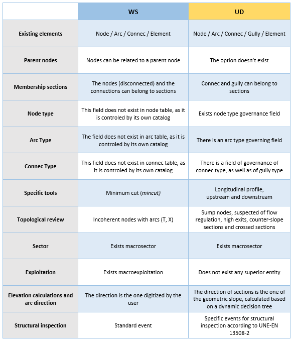
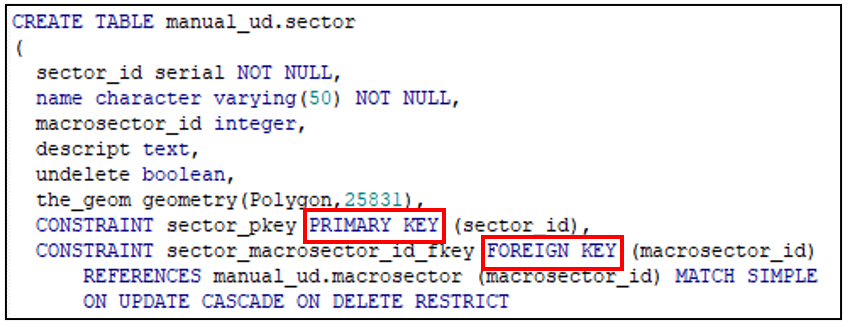

# Basic Work Rules

Once the software installation, the necessary configuration and the creation of data schemas and projects have been completed, the user must become familiar with the basic rules of working with Giswater. Apart from those already mentioned in the previous sections, which were indispensables for preparation process now it is time to make an approximation of the tool operation, its characteristics, and capabilities, with special emphasis on the rules of how to work with the data in a safe way.

One of the main advantages of working combining a database with GIS is the great capacity that can be acquired in terms of robustness of the data thanks to the existence of primary and foreign keys, topological rules, or the possibility of managing the data edition.

In this section the main rules and knowledge, which need to be considered while working with Giswater, will be presented.

## **3.1 Project types**

There are two vastly different types of projects in the world of Giswater, which have great similarities in terms of the structuring and categorization of data, but which at the same time should not be confused by the user. It’s always important to know if you are working on:

* **Water Supply (WS)**

Project related to the drinking **water supply** network of a territory. The data represents all the elements that are necessary for this type of network, starting with the pipes (arc elements) and following with the valves (node elements), that are found along the network among many other elements. Giswater aims to represent as accurately as possible the reality of a water supply system, so it covers all possibilities that may occur in the system.

Specifically, for WS, the main tools are used to regulate and manage water flows, pressures or planning of supply to customers based on the moment. In relation to this, there are sets of tables that allow the monitoring of the flows thanks to SCADA systems or the management of real visits to the elements of the network.

* Urban Drainage (UD)

Project related to the **sanitation and drainage** network of urban waters in a territory. As in WS projects, the aim is to represent the network in the most realistic way possible. Here the main elements are the conduits in which the wastewater circulates. There are elements that coincide with the water supply projects, but most of them are characteristic only for drainage networks, such as the gullies or the sewage treatment plants.

Some of the most prominent tools of this type of project are related to the direction of wastewater circulation, either upstream or downstream. In this sense, Giswater allows to represent a profile of the conduits with relevant information about them.

This guide is unique for both types of project, although individualized manuals for each of them could perfectly exist. It has been worked to unify it to have all the information of Giswater in a single document, but the intention is that within this manual the user can quickly differentiate if the content of a section is specific to a WS project, a UD project or a common section.

To accomplish this goal, all sections of the document that are specific to a project type will be marked with a color: blue for WS and yellow for UD. All the sections presented so far have been common, but from now on the big differences between projects will be shown.

The following table compares some of the highlights of both types of projects:

## **3.2 Available elements**

One of the most attractive and representative characteristics of Giswater is the large number of elements that can be represented in the work environment, a fact that allows a very adjusted representation of reality and that the user can satisfy all its needs in respect of the conditions of the network it manages.

In this section, the functionality of the main existing elements, which are visually represented in the following image, will be developed. Most of the elements are represented here, although later we will see that there are more.

|  |
|:------------------------------------------------------------------:|
| *Schematic representation of different elements in Giswater.*            |

* **Node**

One of the main element types of the network. It is always governed by topological rules. The node-type elements have been divided into a multitude of categories, differentiated for WS and UD projects. They are always represented as points, although some may have associated polygons that represent their real perimeter when needed.

Nodes are always placed between two arcs; therefore, they break these arcs in different entities. Most of the elements perform specific functions to break (such as flow reductions or check valves), although there are nodes that would not normally break arcs, in some special cases they must perform this function. They are the ones represented in image from above:

* **Netwjoin:** is a water connection (*connec*) that by its dimensions or other characteristics is a part of the network and is located on top of an arc.
* **Netgully:** is a *gully* that by its dimensions or other characteristics is a part of the network and is located on top of an arc.
* **Netelement:** is any element that does not usually connect to the network but due to its characteristics must be placed on top of an arc and cut it.
* **Arc**

Arcs, together with nodes, are the main elements of the network. They are located between two nodes and represent the conduits and pipes of the network. There are not as many types of arcs as there are of nodes, although they are also categorized and all their characteristics (such as diameter, material, roughness...) can be added in their attribute table to differentiate them better.

In the image from above, the functioning of a Varc (virtual arcs) is presented. They connect the network topologically between arcs and nodes when in reality an arc reaches a polygon and therefore does not really exist inside it as an arc. This is necessary for the topology rules to work correctly in the Giswater network. They are usually short stretches.

* **Connec**

Connections, the elements that connect the network with buildings or other elements such as fountains. They are point elements, although to link the connections with the rest of the network, links and virtual nodes are used.

* **Gully**

Gullies that are not placed on top of the arcs but are located at a certain distance from the network. Most are of this type; the rest are the netgully and are represented as nodes. They are also specific elements and, like connections, can be related to the network through links and virtual nodes.

* **Vnode**

Virtual nodes are nodes which, like the virtual arcs, do not exist but must exist in the Giswater network so that it works correctly. Virtual nodes are always placed on top of arcs, but, unlike the nodes, they never divide the arcs into two parts.

The function of these elements is to place the gullies and connections that are at a certain distance above the network. These are specific elements that, as mentioned, are represented above the arc closest to the element referred to by the virtual node.

* **Link**

Links are linear elements that relate gullies and connections with their virtual nodes located over the nearest arc, therefore, they perform the function of connecting the separated elements with the network.

* **Element**

This category is available for other types of point elements not connected to the network, which the user can customize himself. It can be network accessories or any other element that is necessary for a representation with the highest possible degree of reality.

In addition to all these main elements, there are some other elements that do not have any topology but are interesting to visualize on the map:

* **Address**: within this group there are all those elements related to the representation of the territory of the network. Normally there are the layers of street axis, municipal limit, perimeter of buildings and portals.
* **Dimensions:** finally, we must mention the layer that represents the dimensions. This will only be filled in when the user uses the specific tool to measure distances between elements. They serve as a complement to the network to be able to see in detail the dimensions created.

## **3.3 General conditions of working with database**

To work correctly with databases that contain a big amount of information, a series of basic rules must be followed so that the data has consistency, and the usability of the database could be maximized.

Most of these rules have to do with the relationships between tables, which, as we will see more ahead, share many columns and fields. In relation to this we must consider foreign keys that allow the information of one table to be a part of another table.

In addition, it is also essential to understand the functionality of primary keys, the columns that restrict the repetition of fields.

|  |
|:------------------------------------------------------------------:|
| *Creation script of a table sector with references of primary and foreign key.*            |

If we check the script image above, it represents the creation script of the sector table, the primary key of the table is sector_id, which means that the content of this column can not be repeated in any case. This table also has a foreign key, which refers to macrosector table and specifically to the macrosector_id field. What does this mean? That the content of the macrosector_id field of this sector table must exist before in the same field of the macrosector table. For example, if in the macrosector_id column of the macrosector table we only have data 1 and 2, to fill the same column in the sector table we can only choose one of these two numbers.

This makes the relationships between tables narrow and many fields have restrictions when adding information for it to be correct. Besides the use of keys, in some tables there are also restrictions of the check type, which limit the possibility of adding data in certain fields only with the established values. The check restrictions are only found where is necessary, since they are tables that require specific values for the system to work correctly and therefore can not be modified.

As already mentioned in section **2.5.1.1**, the use of hierarchical catalogs to categorize the elements is very important and this functionality can only be developed through the use of foreign keys. To add elements in a catalog, they must always be related to some type of higher hierarchy element.

## **3.4 Map zones**

To know how far the water supply and drainage networks reach, Giswater establishes different types of zones that limit the territories of which they are part. Each of these zones has specific characteristics and there are certain relationships between them, managed, as seen in the previous section, with foreign keys.

The following Image  allows to understand the role of each zone and with which elements of the network are related to.

**SUPPLY MAP ZONES**

**SANITATION MAP ZONES**

|  |
|:------------------------------------------------------------------:|
| *Representative diagram of the different areas of the map and the elements that may belong to them*|

The main zones are Sector and Exploitation, which serve as heads of the rest of the zones on the map, each one within its activity. The sectors are delimited with the sole condition of hydraulic coherence and may have great differences in their extension. A single sector can, for example, represent a single street or represent an entire municipality depending on the needs of each managing entity. The only necessary thing is that the sector has a place or several of water inlet and a place or more of water outlet. In a different way, the exploitations have a supply more linked to the territory and are made up of macrodmas and dmas.

All the main elements of the project must be located both within a sector and a exploitation. As shown in image above, some are only related to the exploitation and only the subcatchments must be indispensable within a sector. In no case may an element be unrelated to any of the areas on the map.

## **3.5 Working in a corporative environment**

In an administration department or a company dedicated to water management the employees never work on the same issues nor, usually, a single employee oversees the entire water management process. As is normal, within the Giswater environment, a categorization can be done by different types of work based on the tables or views that one usually uses. Both Giswater and the PostgreSQL database allow the introduction of different work roles, to facilitate the use of the tools within a corporate environment where work is done simultaneously.

The aim of roles is to improve security, preventing users without permission from modifying data likely to generate errors, as well as allowing a customization of some aspects of the project depending on each user with a different role.

The roles available are:

All roles with a higher hierarchy automatically acquire lower role permissions, that is why they are sorted according to the importance and permissions they have.

## **3.6 Default values**

To facilitate the work of the users when inserting data in the different tables and views of the project, Giswater has the option of adding default values to parameters that are mandatory or highly recommended. Through different commands, when a new element is inserted that has fields which have related default values, they are automatically filled in with the established value. The value established by default must always be of the same type as the field to be filled, otherwise the insertion will be wrong.

### 3.6.1 User’s values

User’s default values are those that are managed through the *config_param_user* table. Usually, these values are used during the data insertion process.

Within config_param_user you can add parameters and the values that the program will use by default when filling in the corresponding fields. A clear example of a default value that can be used would be the municipality, in case of having only one, the value of the muni_id field would automatically be that of the only existing municipality.

The use of default values can greatly facilitate the insertion of new elements, but it is advisable to review all the values before definitely adding an element, as it is possible that some default value does not match the value that the inserted element should have. In the case of zones on the map, remember that the default value prevails over the geometry of the zone that Giswater automatically captures. For example, if a new element is going to be inserted within the perimeter of a sector=## 3, the program will capture that the sector would be ## 3, but if we have a default value sector=2, the element will be inserted with sector=2.

From the Giswater plugin itself, you can also manage the default values, using the **Configuration** tool.

### 3.6.2 System values

The default system values are only modifiable by users with administration role. They are related to the configuration of tables and are usually used to manage the parameters of the different topological rules, which are described in the following section. Section **5.2.6** points out information with respect to the default system values, since they can be modifiable from the *plugin* **Configuration** tool.

## 3.7 **Topology rules**

The definition of geospatial topology says: "The topology expresses the spatial relationships between characteristics of vectors (points, polylines and polygons) connected or adjacent in a GIS." Once the meaning is known, we will see some of the main topological characteristics that are important for the use of Giswater in its GIS branch.

### 3.7.1 Introducing state topology

Before explaining the usual topological rules, it must be taken into account that Giswater has certain conditions in relation to the states of the elements, which we call **state topology**. In the following table you can see all the types of modifications (insert or update) between arc and node elements and if they can be carried out taking into account the state of the elements. Above the table you can see the different states available for the elements in Giswater:

The state type that has the most restrictive conditions is **Planified**. Operating with elements in state = 2 is only possible for users with the role of masterplan or higher and it must be kept in mind that the management of these elements can break the topology.

First, it is necessary to have at least one record in the *plan_psector* table, which is used to manage the planning. It is also essential to set a default value for psector. Arcs and nodes will be inserted with this default value in the specific tables: *plan_arc_x_psector* and *plan_node_x_psector*. It is important to check the *state* and *doable* fields.

All elements, whether nodes or arcs, which have **On service** state and the user changes them manually to **Planified**, will be automatically introduced in the default psector that is currently available. Although this change is allowed by the topological rules, it should not be usual to pass a *On Service* element into *Planified*.

### 3.7.2 Arc-node behavior

The correlations between arcs and nodes are probably the most important at the topological level within Giswater, partly because of the large number of elements that come into play. For the program to work properly, it is necessary to fulfill these topological rules. The program itself shows messages to the user when an important rule is about to be broken.

The Giswater *plugin* has a specific tool that allows detecting certain topological errors related to the arcs and nodes. Later we will see how this tool is used, but in this section, we will explain the topological rules that are emphasized:

* **Orphan nodes**: nodes that are not connected to any arc.
* **Duplicated nodes**: nodes that are located exactly at the same place and that is why they produce  incoherence in the system.
* **Topological consistency of nodes**: there are some specific topological rules of Giswater, which consider the type of node. For example, there are types of nodes that must have connections with three different arcs, if not, they will be marked as erroneous.
* **Arcs with the same start and end node**: the arcs must always be placed between two different nodes (with different id), therefore, an arc that starts and ends at the same node is incorrect. This can be configured from the config table and the *samenode_init_end_control* field, where if we have the value *TRUE* the program will not allow arcs with the same start and end node; if we have FALSE, these arcs will be accepted.
* **Arc without start or end node**: Arcs disconnected from one of their ends.

### 3.7.3 Link behavior

Link elements are graphical links between map elements. What a link does is connect an **input** element (connec or gully, also called connections in general) with an **output** element (arc, node, connec or gully).

The attributes related to this graphic link are:

* **Input element**
    * **pjoint_id** - Indetifier of the output element
    * **pjoint_type** - Output element type
    * **arc_id** - Identifier of the arc where the input element are finally conected with. If pjoint_type is ARC, pjoint_id and arc_id will be the same.
* **Output element**
    * For WS arcs have a tab with their related input elements through arc_id.
    * For UD, arcs have a tab with their related input elements. Nodes have a tab with their upstream related input elements.
* **Link**
    * **feature_id** - Identifier of the input element
    * **feature_type** - Input element type
    * **exit_id** - Identifier of the output element
    * **exit_type** - Output element type

**Special features**

1. Regarding its **input** element (which is upstream), the link shares most of its attributes:
    * The visibility of the map, that is, exploitation and state, is taken from it.
    * If the **input** element is deleted, the link is deleted (they are considered to be working as an integrated unit).
    * The link attributes, such as length, diameter or material, are represented and manifested in the data model of the **input** element to which it belongs.
2. Regarding its **output** element (which is downstream), there is no longer pertinence but simply topology, with which:
    * If the **outpu**t point is moved, the link is also moved. If the **output** point is moved to another arc, the arc_id field of the input element is automatically updated.
    * If the **output element** is a connec or a gully, the arc_id value of the parent arc that has the **output** element is copied.
    * The dma_id and fluid_type attributes of the **output** element are passed to both the link and the **input** element.

> **ℹ️ For sanitation projects (UD) the dma_id and fluid_type attributes can be disconnected from the output element. To do this, the variables *Connect autoupdate dma* and *Connect autoupdate fluid* must be set to FALSE in the configuration.**

For sanitation projects (UD) the dma_id and fluid_type attributes can be disconnected from the output element. To do this, the variables Connect autoupdate dma and Connect autoupdate fluid must be set to FALSE in the configuration.

**Ways to connect with links**

By default, when adding a connec or gully, it is disconnected from the network. For there to be a topology between the network and the connections, the links must be created. This can be done in the following ways:

1. **Manually draw the link.** They can be drawn, with the geometry that you prefer, only when input element is connected to an output element, using the usual drawing tools in QGIS.
2. **Connect to network tool.** Using the Giswater plugin tool explained in section 5.2.## 3.7, one or more connections can be connected at the same time. In this case, the link will always connect to the nearest arc in a straight line.
3. **Connect automatically.** There are configuration variables so that, when a new connection is introduced, it automatically connects to the network. The result will be the same as if you connected using the plugin tool.

> **ℹ️ In the connection forms there is a button (Set arc_id) that allows you to previously establish an arc_id. In case of doing so, the ways of connecting nº2 and ## 3 will result in the connection to the established arc and not to the one that is closest.**

**State feature**

**ON SERVICE and OBSOLETE**

* There can only be one link with ON SERVICE state for a connection.
* There can be many links with OBSOLETE state for a connection.
* Mapzone, exit_id and exit_type value are copied from connection to link.

**PLANIFIED**

* For every connection in a psector a new link is created. It can be generated manually or automatically.
* If the link is automatically generated, it could be modified in the alternative of the psector where we are working. The original link will never be modified.
* It is not allowed to delete the arc_id of a planified connection. The whole link must be deleted instead.
* Mapzone, exit_it and exit_type are showed with independence of the original connection, showing data which link and the planified conection has.

### 3.7.4 Double geometry elements

Giswater makes use of double-geometric elements. This means that a single element is formed by two different geometries, in this case they are always points that belong to a polygon.

Only some of the elements of the network have this particularity, because they are types of elements that can have much larger measurements than those that are represented with a simple point and therefore it’s interesting to visualize them as a polygon around the point.

When adding a new node of one of the listed types, a square polygon will be immediately created around the point element. The main topological rules of this relationship are:

* If the node element is moved, the associated polygon will also move to the new position of the node.
* If a new polygon is drawn, with the perimeter that the user wants and around a node of the same type, the new perimeter directly replaces the old one.
* It’s impossible to draw a new polygon without a node of the same type being inside it.
* If a node with double-geometry is deleted, the associated polygon will also be eliminated. On the other hand, the polygon can be deleted without modifying the node.

To work with this type of double-geometric elements it is important to set a configuration that manages it. You can enable or disable this function in the *config* table, *insert_double_geometry* field. If it is enabled (recommended), the *buffer_value* field assigns a default value of the side length of the polygon square. As already said, this square can be edited to have the desired shape.

## **3.8 Summary of work rules applied to the insertion of a NODE element**

To finish this section of basic work rules, an example scheme is presented to summarize all the work rules that need to be followed in the process of inserting a new node element. In the example scheme, the mandatory fields for insertion are defined and the steps to follow for the insertion to be correct can be viewed using arrows. The process is also shown in case insertion is not possible.

Summary schema of the steps that need to be followed in the process of insertion of a node type element. The green lines represent successful steps; the red lines show the different scenarios in which the insertion will not be correct.

The field the_geom is one of the most relevants and in this case one with the easiest rules to understand. When inserting a new element, the geometry of it must be placed inside the geometry of a sector, a dma and a exploitation, otherwise the insertion will be erroneous.

If the state is 2, as mentioned recently, there must be at least one psector, otherwise the insertion will be incorrect. For elements with status "on service" (1), these must follow the topological rules explained in section ***3.7.1.***

The other mandatory fields may have default values or being entered directly by the user. The hierarchies and foreign keys for the catalogs of elements must be respected, which means that trying to insert a node that does not belong to the catalogs, we won’t succeed.