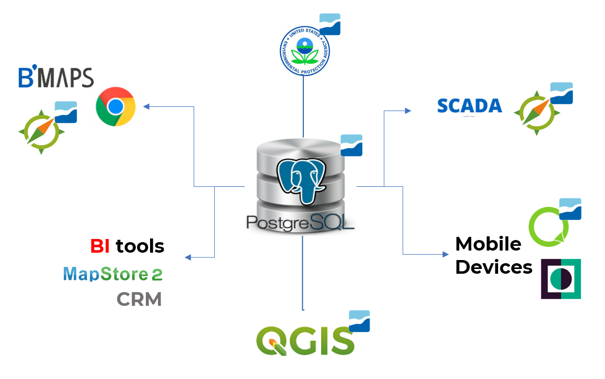

# Introduction

## 1.1 Preamble

Welcome to Giswater, the first open-source software for water cycle management (water supply and urban drainage).

The software has been licensed under the [GNU-GLP 3 License](). 

The following document is licensed under a [Creative Commons Attribution-ShareAlike 4.0 International License](). 

This user’s guide aims to help you start working with Giswater.
## 1.2 What is Giswater?

Giswater is an open-source application for management and exploitation of hydraulic infrastructure elements in both water supply and urbain drainage. It is accessible using database and graphic representation using any kind of geographic information system (GIS).

At the same time, Giswater can act as a driver connecting spatial database with tools used for hydraulic analysis.
Currently Giswater is on the third version of the software, which represents notable improvements comparing with previous versions, not only graphically but also in usability and capabilities.

As presented on this image , Giswater is located between the applications, which used all together allow a solid and global management in relation to water supply and urban drainage models. The central element of the set is the database, where all the information and most of the functionalities of each Giswater project is located. Giswater uses PostgreSQL database, which together with its PostGIS extension allows to conveniently link it with the next application of the set: QGIS.

    Application schema used by Giswater, centralized in the database.

This geographic information system software has been based the development of the Giswater project, in its visual branch and with greater operability by the user. QGIS is related through PostGIS to the database, showing organized spatial data and always considering all the rules, relationships and processes established in the database.

The central point of the project (Database - GIS) also allows to connect with SCADA, to update in real time, the information that comes directly from the physical elements of the network. In this way, Giswater is also a global management system that allows its users to always work with data that is updated automatically.
Apart from the data management through GIS software there is also the possibility of working with Giswater data in web and mobile environment. This functionality is separate from the usual desktop use, since it is only for customers that require it.

## 1.3 What is the goal of this user’s guide?

The most important goal of this guide is to provide the user a document which will help to carry out any task with Giswater, from the initial installation process of the necessary programs to the most complex management operations.
The improvements made in the version 3 will be reflected throughout the manual and the purpose of those improvements, together with the instructions of how to make use of them, will be explained in the best possible way.

Furthermore, on the Github Wiki page there are more specific information about the plugin, with a greater technical focus:

[**Click Here**](https://github.com/Giswater/giswater_dbmodel/wiki)
