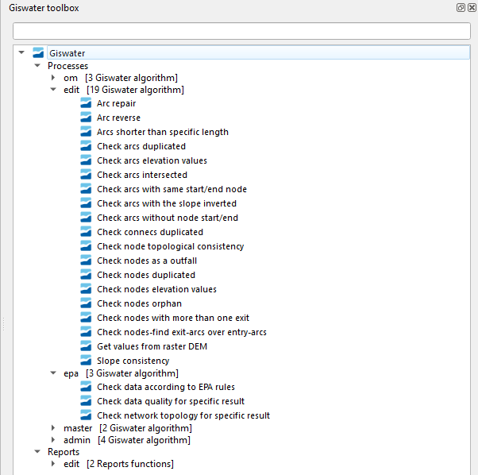
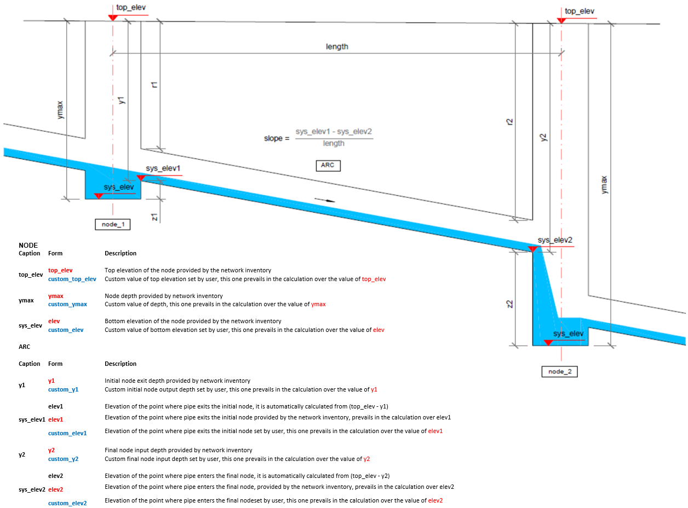

# **7. Topological and Geometrical Adjustments - Giswater Toolbox**
**chapter aims to present Giswater Toolbox, which can be applied to the identification and correction of missing or inconsistent topological data of the network inventory information.**

Giswater toolbox is a very useful tool,  as it enables the user, just by clicking on its tools, to visualize temporary vector layers that spatially show where are the topological and geometrical inconsistencies of the network. Moreover, through the attribute tables, the user can automatically or manually calculate the necessary corrections required for a hydraulic model to run.

|  |
|:------------------------------------------------------------------:|
| *Illustration of Giswater auxiliary toolbox in an UD scheme for finding topological inconsistencies on the CSS network*|

By topological data, we mean all topological and geometrical relationships between nodes and arcs or other geometrical elements of the network. They have attributes values, like depth, top elevation, arc slope, and so on. These attributes are very well explained on the representative image below, for a UD schema.

|  |
|:------------------------------------------------------------------:|
| *Illustration of network topological data for UD schema.*|

This information can also be verified, element by element, using the info button. For nodes, it is also possible to calculate node depth and top elevation with the interpolation and extrapolation tool, just as shown below.

For example, for a CSS (combined sewer system - UD schema), the first changes on the network can be based on the DEM raster data, interpolation, or extrapolation of elevation values from nearby nodes by specific giswater tools. Then, after completing all the missing information for the node layer, another check on arc slopes and negative offset values can be done, by the use of Giswater toolbox. Changes in the arc bottom elevation when entering or exiting a node, or the node depth and bottom data, enable the user to easily set hydraulic consistent slopes and topological information for the nodes and arcs. All those changes can be saved as customer data, keeping, at  the same time, the inventory data unmodified, when building hydraulic models.

Here below you can find some examples of the application of the toolbox for finding topological inconsistencies, and other typical geometrical incongruities on the inventory data of the network system:

**1. CHECK PROJECT**

|  |
|:------------------------------------------------------------------:|
| *Audit check information about hydraulic model*|

**2. Check arcs without node start/end**

|  |
|:------------------------------------------------------------------:|
| *Check arcs without node start/end tool*|

|  |
|:------------------------------------------------------------------:|
| *Temporary layers with arcs without nodes in Qgis ToC and Canvas, as well as info log tab with the list of the arcs that present this type of problem.*|

**3. Slope inconsistency**

|  |
|:------------------------------------------------------------------:|
| *Generation of slope inconsistency of arc, creating temporary layer for all the incongruities found and attribute metadata information*|